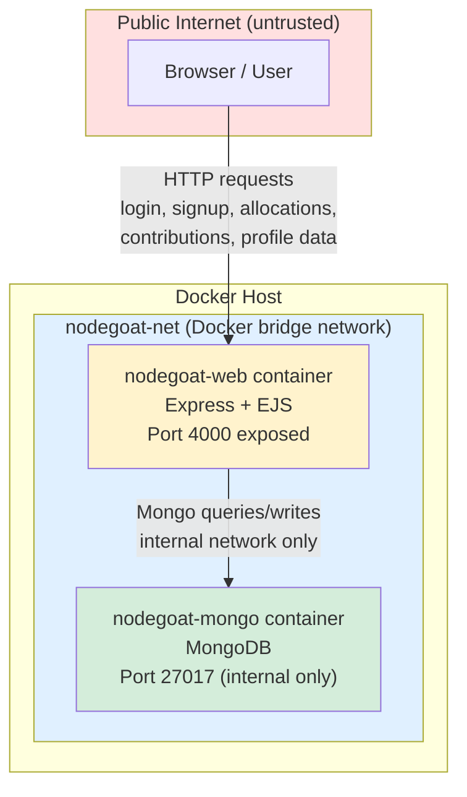

# NodeGoat Architecture Diagram

**Trust boundaries:**
- **Boundary 1**: Public internet ↔ `nodegoat-web` (port 4000 exposed to host) — untrusted input enters here
- **Boundary 2**: `nodegoat-web` ↔ `nodegoat-mongo` (internal Docker network only, port 27017 not exposed to host in production) — only the web container should reach the DB